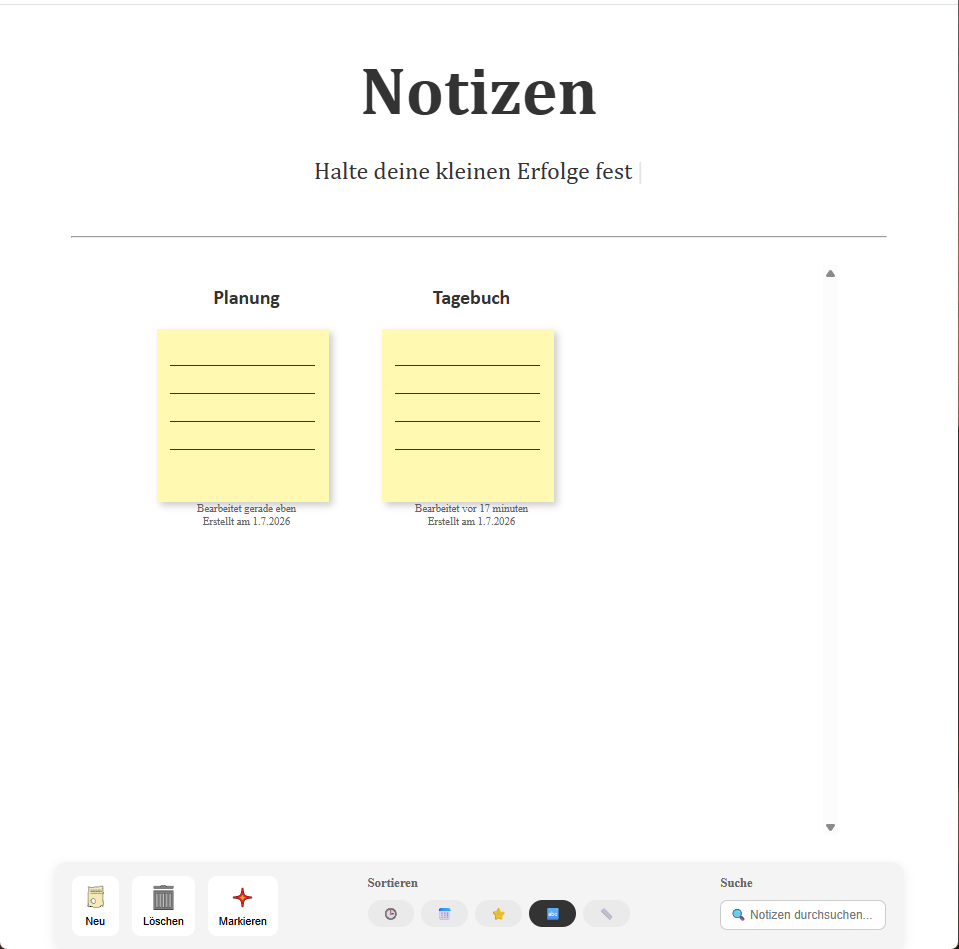
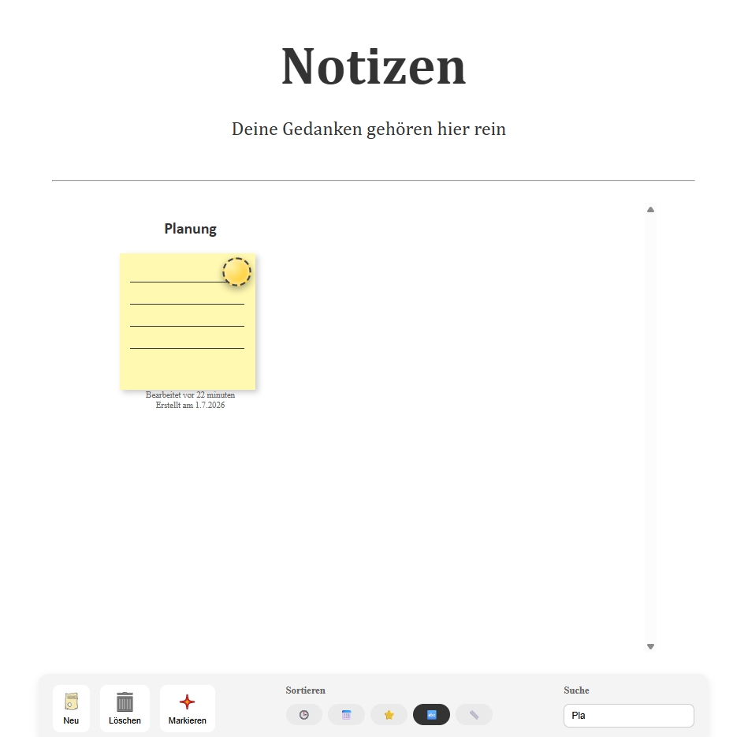
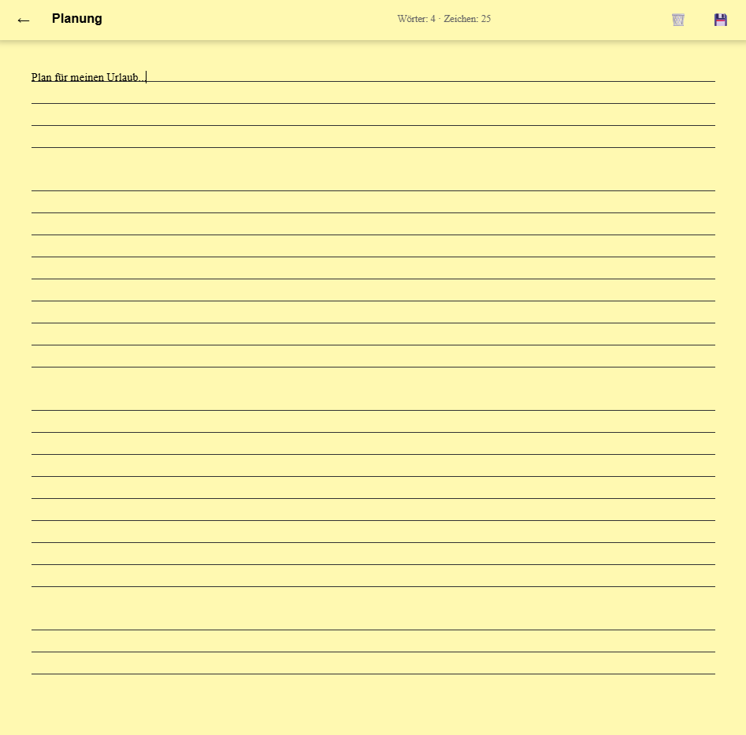

# Notiz-Webseite
Diese Webanwendung dient dem **Erstellen**, **Bearbeiten** und **Verwalten** von Notizen. Benutzer können ihre **Gedanken** und **Ideen** festhalten, die mithilfe von **Local Storage** gespeichert werden. Zusätzlich können Benutzer Notizen **löschen**, **markieren**, **umbenennen**, **suchen** und mit fünf verschiedenen Kriterien **filtern**.

## Funktionen
- Erstellen, Bearbeiten und Löschen von Notizen
- Notizen markieren, speichern und filtern
- Suche anhand eines Notiznamens
- Filtern nach Größe/Länge, Markierung, Name (A-Z) sowie Bearbeitungs- und Erstellungsdatum
- Spezielle Effekte (Easter Eggs) bei bestimmten eingegebenen Notiznamen

## Technologien & Tools
1. HTML5
2. CSS3
3. TypeScript
4. Lokale Entwicklung mit Live Server (localhost)

## Screenshots
### Startseite

### Filter

### Notiz

## Was habe ich gelernt?
- Verbesserter Umgang mit HTML und CSS
- Nutzung von TypeScript
- Vertiefung und Erweiterung bestehender Kenntnisse im Webdesign
- Sicherer Umgang mit Localhost und Objekten
